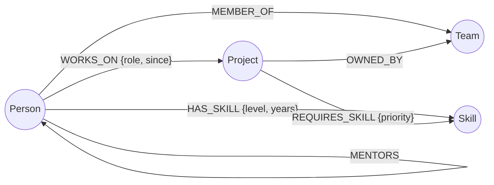
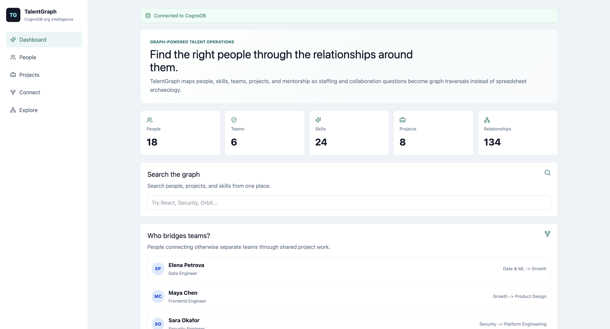
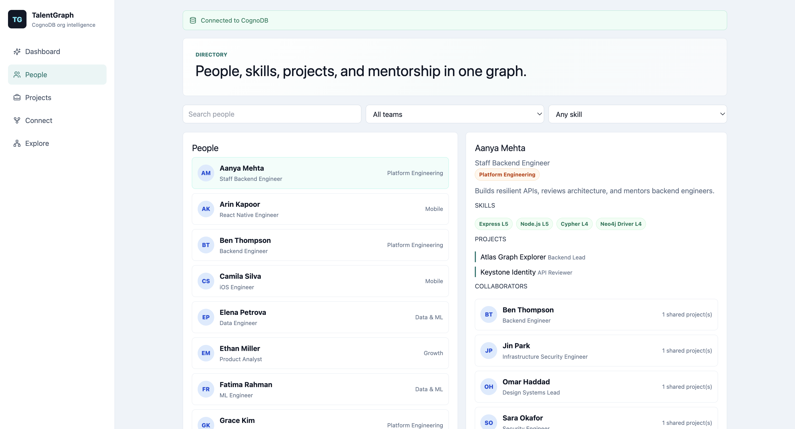
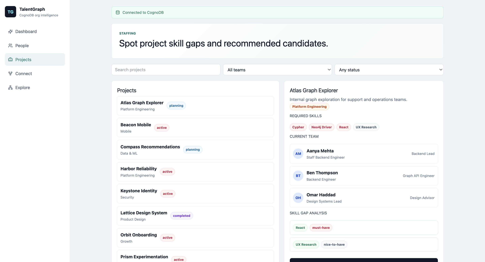
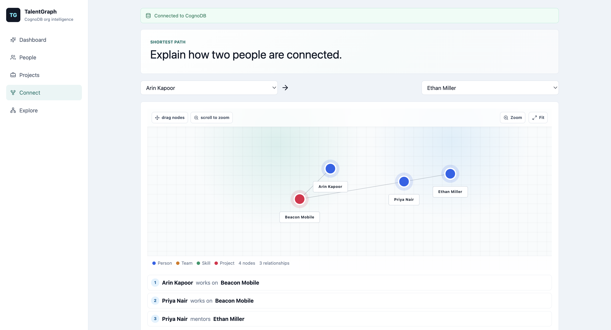
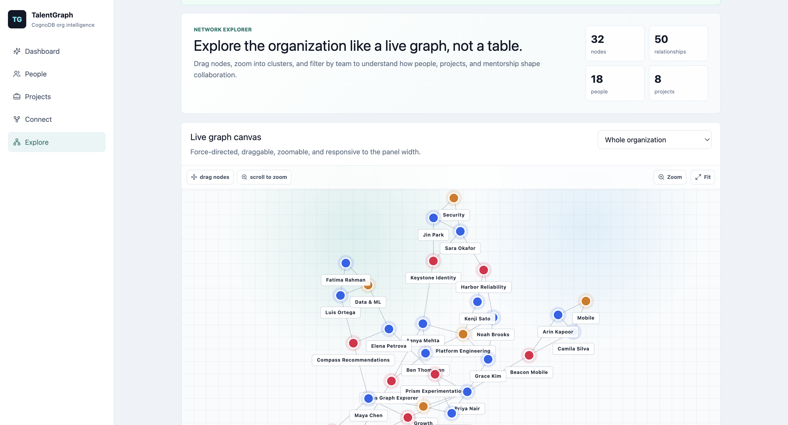

# TalentGraph

TalentGraph is a React + Express application backed by CognoDB Cloud. It models an organization as a graph of people, teams, skills, projects, and mentorship relationships so non-technical users can answer questions like:

- Who has the skills this project is missing?
- How are two people connected through teams, projects, or mentorship?
- Who bridges otherwise separate teams?
- What does the collaboration network look like?

## Live Demo And Recording

- Hosted demo: pending deployment
- Screen recording: pending final walkthrough

These two items are part of the final submission checklist and should be completed after CognoDB credentials are configured, seed data is loaded, and screenshots are captured.

Current database status: CognoDB is configured and seeded with 56 nodes and 134 relationships.

## Why A Graph Database?

TalentGraph is about relationships, not isolated records. The useful questions are multi-hop traversals:

- Project staffing gaps follow `Project -> REQUIRES_SKILL -> Skill <- HAS_SKILL <- Person`.
- Collaborators follow `Person -> WORKS_ON -> Project <- WORKS_ON <- Person`.
- Shortest-path discovery can cross `WORKS_ON`, `MEMBER_OF`, and `MENTORS` relationships without knowing the number of hops in advance.
- Bridge detection finds people who connect different teams through shared project work.

In a relational database these features require repeated joins, self-joins, exclusion queries, and recursive CTEs. In CognoDB, they are direct Cypher pattern matches.

## Data Model



| Node | Properties |
| --- | --- |
| `Person` | `id`, `name`, `title`, `email`, `bio` |
| `Team` | `id`, `name`, `focus` |
| `Skill` | `id`, `name`, `category` |
| `Project` | `id`, `name`, `description`, `status` |

| Relationship | Properties |
| --- | --- |
| `MEMBER_OF` | none |
| `HAS_SKILL` | `level`, `years` |
| `WORKS_ON` | `role`, `since` |
| `MENTORS` | none |
| `REQUIRES_SKILL` | `priority` |
| `OWNED_BY` | none |

## Tech Stack

- React + Vite frontend.
- Express JavaScript API.
- CognoDB Cloud as the graph database.
- Official `neo4j-driver` JavaScript package over `bolt+s://`.
- Axios client instance for frontend API calls.
- Tailwind CSS and custom CSS for the UI.

## Setup

### 1. Create CognoDB Cloud Instance

1. Go to `https://console.cognodb.com/signup`.
2. Create a free `c0` instance.
3. Copy the connection URI, which looks like `bolt+s://<instance-id>.databases.cognodb.cloud`.
4. Save the generated password for the `cognodb` user. CognoDB shows it only once.

### 2. Configure Environment

Copy the example env file:

```bash
cp .env.example .env
```

Fill in:

```bash
COGNODB_URI=bolt+s://your-instance-id.databases.cognodb.cloud
COGNODB_USERNAME=cognodb
COGNODB_PASSWORD=your-generated-password
PORT=8080
CLIENT_ORIGIN=http://localhost:5173
VITE_API_BASE_URL=
```

Never commit real credentials. `.env` is ignored by Git.

`VITE_API_BASE_URL` can stay empty locally because Vite proxies `/api` to the Express server. On Netlify, set it to the deployed Render API URL.

### 3. Install Dependencies

```bash
npm install
```

### 4. Run Migrations

```bash
npm run migrate
```

The migration script:

- Verifies CognoDB connectivity.
- Creates node id uniqueness constraints.
- Creates read-oriented indexes for common search/filter fields.
- Uses idempotent Cypher so it is safe to run more than once.

### 5. Seed CognoDB

```bash
npm run seed
```

The seed script:

- Verifies CognoDB connectivity.
- Clears existing graph data.
- Applies graph schema migrations.
- Loads realistic teams, skills, people, projects, and relationships.
- Uses parameterized `UNWIND` writes through the official Neo4j driver.

### 6. Run Locally

```bash
npm run dev
```

- React client: `http://localhost:5173`
- Express API: `http://localhost:8080`
- Health endpoint: `http://localhost:8080/api/health`
- Liveness endpoint: `http://localhost:8080/api/health/live`
- Readiness endpoint: `http://localhost:8080/api/ready`

### 7. Verify API

With the API running, execute the smoke test:

```bash
npm run smoke
```

To test a deployed API or a different local port:

```bash
API_BASE_URL=https://your-api-url npm run smoke
```

Run the full API integration test suite:

```bash
npm test
```

## Main Features

- Dashboard with graph stats, global search, and bridge-person insight.
- People directory with team and skill filters.
- Person profile with skills, projects, mentors, mentees, and collaborators.
- Project directory with project detail and skill-gap analysis.
- Candidate recommendations with skill level, years, and fit score.
- Server-side pagination for people and projects.
- Debounced search inputs to avoid unnecessary API calls.
- Browser-history route navigation for dashboard, people, projects, connect, and explore views.
- Shared frontend app-data context for health, teams, and skills.
- Shortest path between two people.
- Draggable, zoomable organization graph explorer.
- Cypher inspector panels for the most important graph queries.
- Loading, empty, and database error states.
- Backend request IDs, rate limiting, validation, read caching, structured errors, readiness checks, and graceful shutdown.
- Consistent `ApiResponse` and `ApiError` response structure across success and failure flows.
- Graph domain model constants for labels, relationship types, project statuses, and entity id validation.
- Versioned CognoDB migrations for constraints and indexes.
- API smoke test covering success and error paths.

## Main Cypher Queries

### Skill Gap Analysis

Find required project skills that the current project team does not cover, then recommend candidates elsewhere in the organization.

```cypher
MATCH (pr:Project {id: $id})-[req:REQUIRES_SKILL]->(s:Skill)
OPTIONAL MATCH (pr)<-[:WORKS_ON]-(coveringPerson:Person)-[:HAS_SKILL]->(s)
WITH pr, s, req.priority AS priority, count(coveringPerson) AS coveredCount
WHERE coveredCount = 0
OPTIONAL MATCH (candidate:Person)-[hs:HAS_SKILL]->(s)
WHERE NOT (candidate)-[:WORKS_ON]->(pr)
RETURN s, priority, candidate, hs
ORDER BY hs.level DESC, hs.years DESC
```

### Shortest Path

Find a variable-length path between two people across project, team, and mentorship relationships.

```cypher
MATCH (from:Person {id: $fromId}), (to:Person {id: $toId})
MATCH path = shortestPath((from)-[:WORKS_ON|MEMBER_OF|MENTORS*..8]-(to))
RETURN path
```

### Bridge People

Find people who connect different teams through shared project work.

```cypher
MATCH (person:Person)-[:MEMBER_OF]->(homeTeam:Team)
MATCH (person)-[:WORKS_ON]->(project:Project)<-[:WORKS_ON]-(peer:Person)-[:MEMBER_OF]->(peerTeam:Team)
WHERE homeTeam.id <> peerTeam.id
RETURN person, homeTeam, peerTeam, count(DISTINCT project) AS bridgeStrength
ORDER BY bridgeStrength DESC
```

## Project Structure

```text
client/
  public/
    _redirects
  src/
    api.js
    components.jsx
    context/
    cypherSnippets.js
    hooks/
    lib/
    main.jsx
    styles.css
server/
  migrations/
    001_create_graph_constraints_and_indexes.js
    index.js
  scripts/
    migrate.js
    seed-data.js
    seed.js
    smoke.js
  src/
    controllers/
    db/
    domain/
    mappers/
    middleware/
    repositories/
    routes/
    services/
    utils/
  tests/
    catalog.test.js
    errors.test.js
    graph.test.js
    health.test.js
    insights.test.js
    path.test.js
    people.test.js
    projects.test.js
    search.test.js
    stats.test.js
    helpers/
docs/
  assignment-analysis.md
  screenshots/
```

## Screenshots

Screenshots are stored under `docs/screenshots/`.

### Dashboard



### People Profile



### Project Skill Gap



### Shortest Path



### Network Explorer



## Submission Checklist

- [x] React + Express application.
- [x] CognoDB connection through official Neo4j JavaScript driver.
- [x] Environment-based connection details.
- [x] Seed script with realistic graph data.
- [x] Layered API structure with routes, controllers, services, repositories, mappers, and shared utilities.
- [x] Graph domain model constants instead of fake ORM models.
- [x] Versioned CognoDB migration runner for constraints and indexes.
- [x] Parameterized Cypher repository queries.
- [x] Frontend Axios instance, debounced API calls, route navigation, shared context, and paginated directories.
- [x] Production-style API hardening with request IDs, rate limiting, validation, caching, structured errors, health/readiness endpoints, and graceful shutdown.
- [x] Automated API smoke test.
- [x] API integration tests covering happy paths, validation errors, missing resources, unsupported methods, malformed JSON, caching, and rate limiting.
- [x] Functional UI with loading, empty, and error states.
- [x] README with use case, graph explanation, setup, data model, and queries.
- [x] CognoDB instance created and seeded.
- [x] Screenshots added.
- [ ] Hosted demo deployed.
- [ ] Short screen recording created.
- [ ] Repository URL and demo link emailed to `hr@wexa.ai` with subject `CognoDB Assignment 2 - <Your Name>`.
